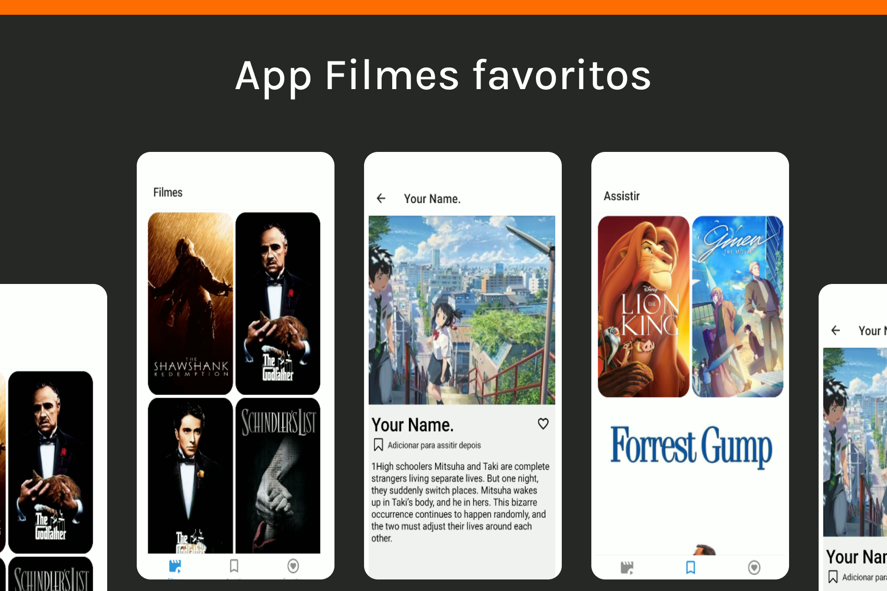
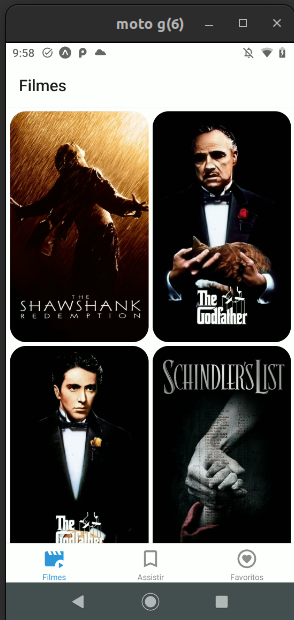
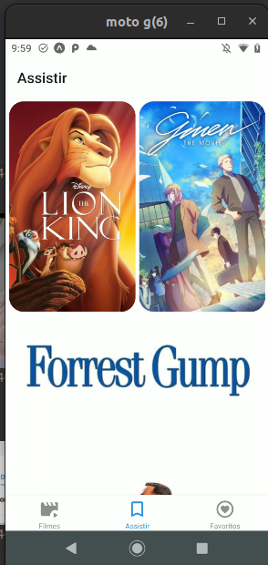
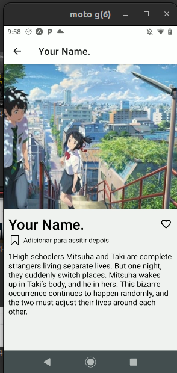

<h1 align="center">Projeto - Filmes favoritos</h1>

<p align="center">
  

  

  
  
  <a href="https://github.com/williamjayjay/Github-Blog/commits/master">
    
  </a>
    
   <a href="https://github.com/williamjayjay/movieapp-reactnative-tanstackquery/stargazers">
    
  </a>
</p>

<p align="center"><p align="center">
Este aplicativo tem como principais funcionalidades a busca de filmes de uma api limitada, mas também adicionar os filmes preferidos á tela e também rota de filmes favoritos, assim como também a tela e rota de filmes para assitir mais tarde.</p>

<p align="center">

</p>

## 🥶 Sobre o projeto

Desenvolvi esse projeto como forma de reforçar os estudos.

## Mobile React Native:

**Aplicativo:** O app irá buscar e exibir dados de uma api de filmes, mas também adicionar os filmes aos favoritos e também aos filmes para assistir mais tarde.

## 🚀 Tecnologias

Principais tecnologias que utilizei para desenvolver esta aplicação

- [Typescript](https://www.typescriptlang.org/)
- [Tanstack Query](https://tanstack.com/query/latest/docs/framework/react/overview)


## Guia de inicialização

Para instalar e configurar uma cópia local, siga estas etapas simples:

### Prerequisitos

Para garantir o funcionamento adequado da nossa aplicação, verifique abaixo:

1. **Clone o repositório**:
  ```sh
  git clone https://github.com/williamjayjay/movieapp-reactnative-tanstackquery
  ```

2. **Navegue na raiz do projeto movieapp-reactnative-tanstackquery:**

3. **Instale os módulos:**
  ```sh
  bun i
  ```

4. **Copie o .env de exemplo:** 

5. **Faça o cadastro e adquira suas credenciais e tokens no site da api de filmes:**
  ```sh
  https://api.themoviedb.org
  ```
 
6. **Rode o aplicativo:**
  ```sh
  bun android
  ```

## Roadmap

- [x] Iniciar o aplicativo, entrar na tela home.

- [x] Conseguir navegar para a tela index clicando em qualquer filme.

- [x] Conseguir adicionar e remover filmes dos favoritos clicando no ícone de coração.

- [x] Conseguir adicionar e remover filmes marcados para assistir depois clicando no ícone de flag.

- [x] Conseguir realizar a navegação entre tabs.

<!-- --------------------- -->

| Tela Home | Tela de Favoritos |
|:-------------------------:|:-------------------------:|
|  |  |

| Tela Index |
|:-------------------------:|
|  |